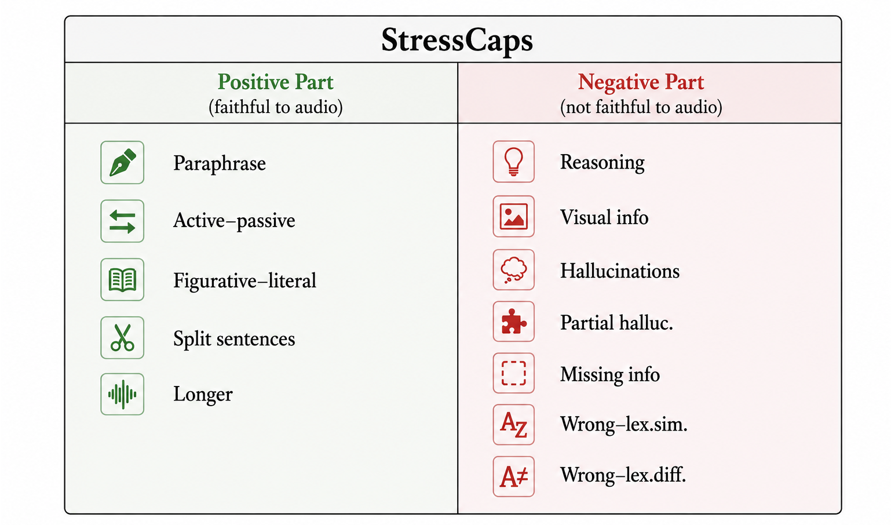
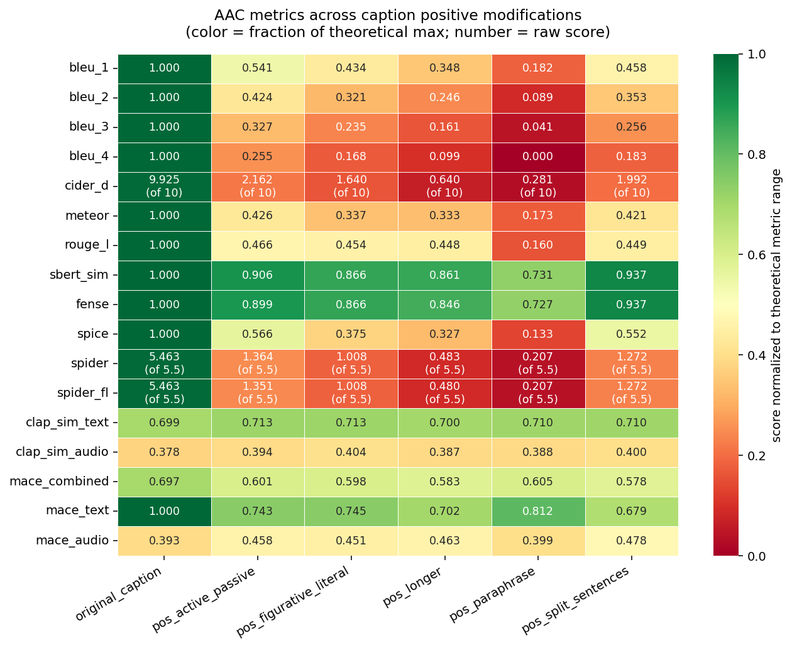
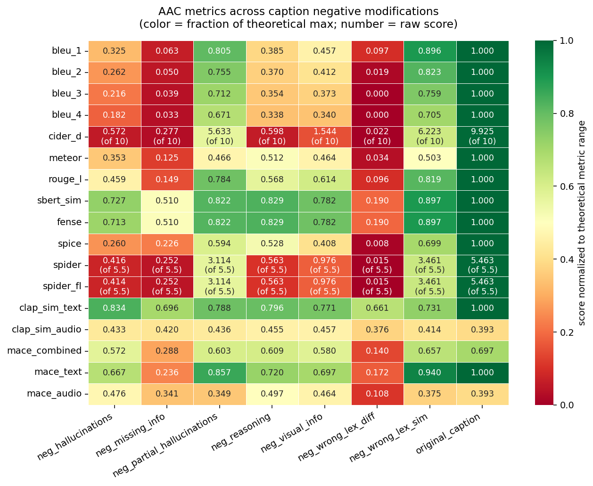
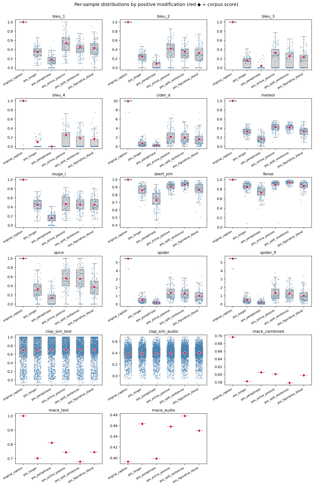
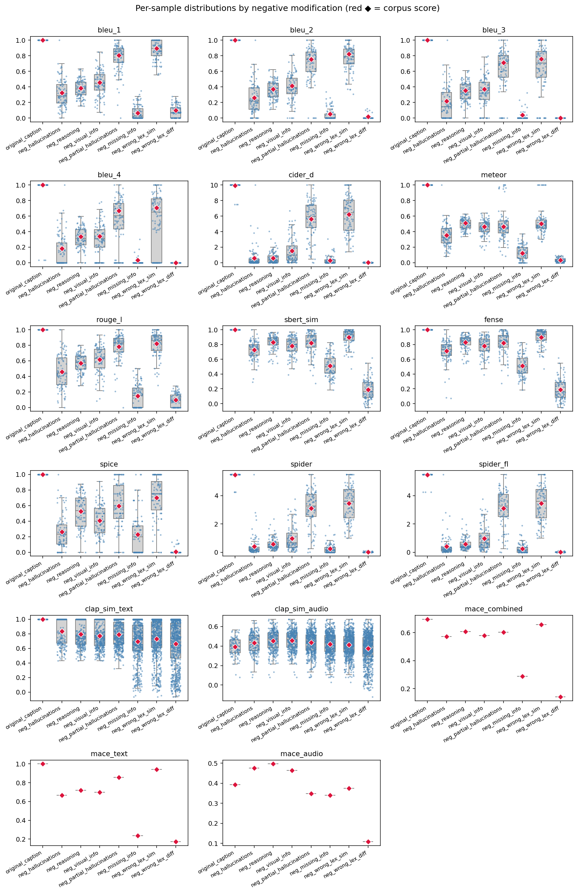
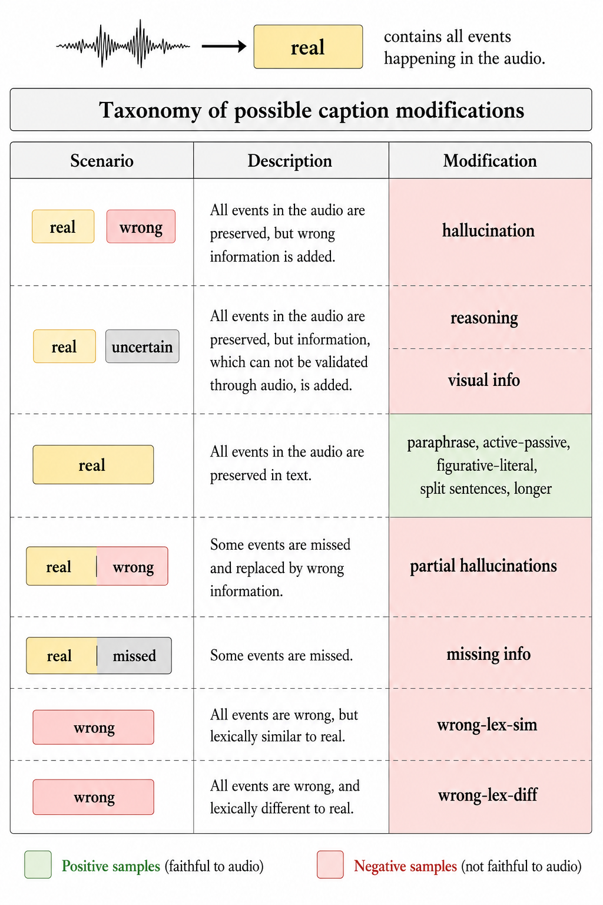

# StressCaps dataset

> A diagnostic benchmark for evaluating captioning metrics under controlled semantic perturbations.

  

## AAC Metrics Evaluation

### Results

  
  

  <em><b>Figure 2.</b> Metric robustness under meaning-preserving perturbations (left) and meaning-corrupting perturbations (right).</em>

  
  

  <em><b>Figure 3.</b> Distribution of metric scores across meaning-preserving perturbations (left) and meaning-corrupting perturbations (right). Each boxplot summarizes the score distribution of a metric over all perturbation instances within the corresponding category.</em>

## Introduction

## Dataset Creation

StressCaps is a diagnostic benchmark designed to evaluate the robustness and reliability of captioning metrics under controlled semantic perturbations. The benchmark is constructed from reference captions sampled from the AudioCaps test set and systematically transformed using a large language model to create both meaning-preserving and meaning-corrupting variants.

### Generation Pipeline

Starting from a human-written reference caption, we generate multiple perturbed captions using Qwen3-VL-235B-Instruct. Each perturbation is created through carefully designed prompts targeting a specific semantic transformation category.

The generation process follows the pipeline below:

### Perturbation Taxonomy

  

  <b>Figure 1.</b> Perturbation Taxonomy.

StressCaps is designed around a hierarchical taxonomy of semantic perturbations, which are summarized in Figure 1.

Starting from an original caption, there are several possible ways in which its semantic content can be perturbed. StressCaps organizes these perturbations according to whether the modified caption preserves, adds, removes, or corrupts information from the original caption.

At the most basic level, a perturbed caption may still preserve all information from the original caption. In this case, it describes the same audio events, but may differ in wording, sentence structure, or style. These transformations correspond to meaning-preserving perturbations, such as paraphrasing, active-passive conversion, or sentence restructuring.

A caption may also preserve all original information while adding extra information. The added information can be either clearly wrong, such as hallucinated sound events, or uncertain and unsupported by the audio. Unsupported additions include model-generated reasoning, causal explanations, or visual details that cannot be verified from the audio signal alone.

If no additional information is introduced, the caption may either remain equivalent to the original caption or contain errors within the original semantic scope. In this case, some information may be incorrect, or some important information may be missing. These perturbations test whether a metric can detect partial semantic corruption while the caption still overlaps substantially with the reference.

Finally, the strongest type of perturbation occurs when the whole caption is semantically wrong. In this case, the modified caption describes different events from the original audio and should be strongly penalized by a reliable captioning metric.

| Meaning-Preserving Perturbations | Example |
|----------------------------------|---------|
| Active ↔ Passive | *A dog chases a ball.* → *A ball is chased by a dog.* |
| Paraphrase | *A dog barks loudly.* → *A loud bark can be heard from a dog.* |
| Figurative ↔ Literal | *Thunder roars in the distance.* → *Loud thunder sounds can be heard in the distance.* |
| Sentence Restructuring | *A child laughs while music plays.* → *Music is playing as a child laughs.* |
| Elaborated Paraphrase | *A dog barks.* → *A dog repeatedly barks while remaining the primary audible sound.* |

| Meaning-Corrupting Perturbations | Example |
|----------------------------------|---------|
| Hallucinated Events | *A dog barks.* → *A dog barks while a siren sounds nearby.* |
| Missing Information | *A dog barks while a car passes.* → *A dog barks.* |
| Unsupported Reasoning | *A dog barks repeatedly.* → *A dog barks repeatedly because it sees a stranger.* |
| Visual Information Injection | *People are talking.* → *Several people wearing blue shirts are talking.* |
| Wrong Meaning | *A dog barks.* → *A cat meows.* |

